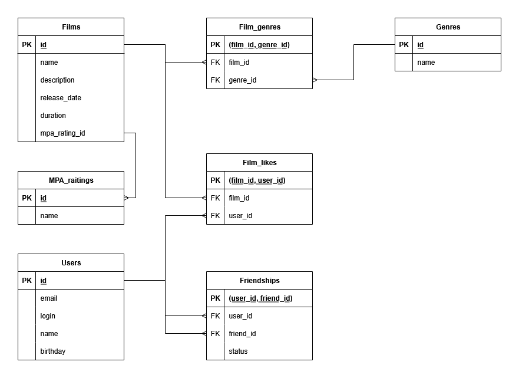

# Схема базы данных



# Примеры основных SQL-запросов к БД

### Получить все фильмы
```sql
SELECT *
FROM Films;
```

### Получить всех пользователей
```sql
SELECT *
FROM Users;
```

### Топ N наиболее популярных фильмов по количеству лайков (например, первые 12)
```sql
SELECT f.id, f.name, COUNT(fl.user_id) AS likes_count
FROM Films f
LEFT JOIN Film_likes fl ON f.id = fl.film_id
GROUP BY f.id, f.name
ORDER BY likes_count DESC
LIMIT 12;
```

### Список общих друзей с другим пользователем (например, для пользователей с id 1 и 2)
```sql
SELECT u.id, u.name
FROM Users u
JOIN Friendships f1 ON u.id = f1.friend_id AND f1.user_id = 1 AND f1.status = true
JOIN Friendships f2 ON u.id = f2.friend_id AND f2.user_id = 2 AND f2.status = true;
```


### Фильмы определённого жанра (например, "комедия")
```sql
SELECT f.id, f.name
FROM Films f
JOIN Film_genres fg ON f.id = fg.film_id
JOIN Genres g ON fg.genre_id = g.id
WHERE g.name = 'комедия';
```

### Добавить нового пользователя
```sql
INSERT INTO Users (email, login, name, birthday)
VALUES ('user1@mail.com', 'user1', 'User Userovich', '1990-01-02');
```

### Добавить лайк фильму (например фильму с id 10 лайк от пользователя с id 3)
```sql
INSERT INTO Film_likes (film_id, user_id)
VALUES (10, 3);
```

### Отправить запрос на дружбу (например, от пользвателя с id 1 пользователю с id 2)
```sql
INSERT INTO Friendships (user_id, friend_id, status)
VALUES (1, 2, false);
```

### Принять запрос на дружбу
```sql
UPDATE Friendships
SET status = true
WHERE user_id = 1 AND friend_id = 2;
```

### Удалить фильм (например с id 5)
```sql
DELETE FROM Films
WHERE id = 5;
```